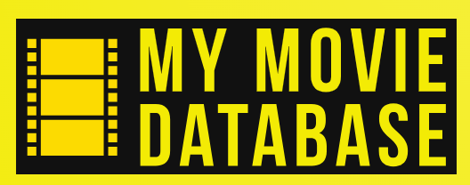

# Individuell Examination - MyMovieDB

## Introduktion 
Hej där, blivande React-mästare! Det är dags att ta våra kreativa kunskaper till nästa nivå och omvandla vår filmdatabas-saga till en interaktiv och förbluffande modern upplevelse! Precis som våra tidigare äventyr har förberett oss för detta ögonblick, är det nu dags att slå på React-motorn och skapa magi på webben. Vi tar med oss all vår tidigare kodningserfarenhet och kastar oss in i en värld av komponenter, statehantering och interaktivitet. Det är som att gå från en vanlig 2D-film till en fullständig 3D-upplevelse! Tillsammans kommer vi att omdefiniera vad det innebär att bygga en filmdatabas, och visa att med React finns det inga gränser för våra kreativa möjligheter på webben. Så låt oss ta plats bakom koden, rulla kameran och skapa vårt eget mästerverk - för i React-universumet är det endast fantasin som sätter gränsen för vad vi kan uppnå!

## Instruktioner

### Uppgift
Din uppgift går ut på att skapa en basic applikation för filmälskare. Appen skall läsa in filmer från ett REST-API och presentera dessa för användaren. Användaren skall även kunna lägga till och ta bort filmer, favoritmarkera filmer, samt öppna upp varje enskild film för att se en trailer.

### User Stories
- Som användare vill jag att appen skall vara snygg och se professionell ut, så att jag vågar lita på att applikationen är seriös.
- Som användare vill jag att gränssnittet är responsivt och lättanvänt (på skärmar mellan 375px - 500px), så att jag kan använda det på olika mobila enheter utan att behöva lägga ner för mycket tid på att lära mig hur det fungerar.
- Som användare vill jag kunna lägga till nya filmer på webbsidan, för att hålla koll på vad jag sett.
- Som användare vill jag kunna ta bort filmer från webbsidan.
- Som användare vill jag kunna favoritmarkera en film, för att hålla koll på vilka filmer jag sett och gillat.
- Som användare vill jag kunna se trailern för en film (om den existerar), för att undersöka om filmer är något för mig.

### Krav

#### För godkänt
- Måste alla user stories vara uppfyllda
- Måste sidan ha en acceptabel styling (jämna marginaler, inget overflow osv.)
- Måste ni ha en rimlig uppdelning mellan pages och components
- Får det inte förekomma några *any*-typer

#### För väl godkänt
- Skall ni använda er av Zustand för global tillståndshantering (skapa minst en store)
- Skall inloggning og registrering implementeras, endast inloggade användare får använda appen (tips: använd sessionStorage för att lagra inloggad användare)
- Måste koden vara väluppdelad, välindenterad och välskriven 

### Resurser
I mappen backend hittar ni ett fullt fungerande REST-API som ni skall dra hem, och placera i samma mapp som ert projekt. När ni lagt *backend*-mappen i er projektmapp öppnar ni en terminal i *backend-mappen* och kör följande kommandon:
```
npm i
npm start
```
Backendservern är inställd på PORT 8080, om den skulle vara upptagen på er dator så går ni in i filen *server.js* och ändrar till önskad port på rad 8 i koden. I övrigt så rör ni inte koden i *backend*-mappen.

I denna uppgift kommer ni att behöva använda er av de fyra HTTP-anropen. Beskrivning följer nedan.

#### Hämta nyckel
Detta anropet hämtar en API-nyckel som krävs för att få tillgång till APIet.
```
GET http://localhost:8080/api/keys
```

#### Hämta filmer
Detta anrop hämtar alla filmer som finns i APIet.
```
http://localhost:8080/api/movies?key=<API-nyckel>
```

#### Lägg till film
För att lägga till en ny film behöver ni skicka med den nya filmen i bodyn på ert POST-anrop. Se min demonstration av uppgiften för mer information om hur ni gör detta. Den nya filmen måste innehålla nycklarna title, poster och trailer_link
```
POST http://localhost:8080/api/movies?key=<API-nyckel>
```


#### Av-/påmarkera favoritfilm
För att av-/påmarkera en favoritfilm så behöver ni göra ett PUT-anrop där ni skickar med imdbid:t för den aktuella filmen.
```
PUT http://localhost:8080/api/movies/<imdbid>?key=<API-nyckel>
```

#### Radera en film
För att radera en film helt från APIet så behöver ni göra ett DELETE-anrop där ni skickar med imdbid:t för den aktuella filmen.
```
DELETE http://localhost:8080/api/movies/<imdbid>?key=<API-nyckel>
```

#### Logga in (för VG)
Här behöver ni skicka med användaren i anropets body
```
POST http://localhost:8080/api/auth/login
```

#### Logga ut (för VG)
```
POST http://localhost:8080/api/auth/logout
```

#### Registrera ny användare (för VG)
Här behöver ni skicka med användaren i anropets body
```
POST http://localhost:8080/api/auth/register
```

### Exempeldata
Exempeldata att stoppa in när ni skall skapa en ny film [hittar ni här](https://santosnr6.github.io/Data/movies.json)

### Design
Ni har fria tyglar att designa er egen applikation. Om ni vill så får ni jättegärna använda er av den design som jag visar i mitt exempel (ni hittar frames på denna i mappen assets).

### Videogenomgång
Genomgång av uppgifter [hittar ni här](https://folkuniversitetet-se.zoom.us/rec/share/fpQn-6zd5C5-lPW7MDJLmrUsStJWjVJJA0edAVUvY94BVFznSbPImz9sGRTFht_H.Q_J_Izs5An7qpx3k
) Lösenkod: S@dj8.N2

### Inlämning
Länken till ert repo laddas upp på Azomo senast den 16/6, kl 23:59.
